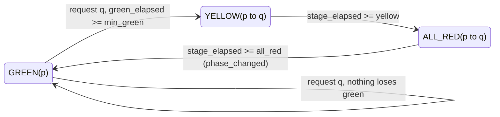

# Traffic signals

A signalised intersection runs a **signal program** (its phases and intergreen times) and
a **controller** that picks the next phase. The controller only chooses; a shared state
machine owns minimum green, yellow and all-red, so every controller, including your own,
switches safely.

## Programs and phases

The `signal` block of a signalised intersection lists its phases in cycle order. A phase
names the movements that have green: `"G"` is protected, `"g"` permissive (it yields to
conflicting protected traffic). Every movement not listed is red. Yellow and all-red never
appear in phases; they are inserted automatically.

```json
"signal": {
  "controller": {"type": "fixed_time", "params": {"offset": 0}},
  "yellow": 3, "all_red": 1, "min_green": 5, "max_green": 60, "initial_phase": 0,
  "phases": [
    {"id": "EW", "duration": 30, "green": {"W_in->E_out": "G", "E_in->W_out": "G",
                                           "W_in->N_out": "g", "E_in->S_out": "g"}},
    {"id": "NS", "duration": 30, "green": {"N_in->S_out": "G", "S_in->N_out": "G"}}
  ]
}
```

When `phases` is omitted they are derived from the `template` (`two_phase`,
`protected_left`, `split` or `auto`; see [Scenario format](scenario-format.md#derivation-rules)).
A phase may override the signal's `min_green` and `max_green`. Validation warns about a
movement that is never green (W301), two conflicting protected movements in one phase
(W302; allowed, they then take turns first come, first served), `yellow = 0` (W303) and
stage lengths that are not multiples of `dt` (W305).

## Transitions

Switching from phase *p* to phase *q* compares the two phases movement by movement:

| set | movements | during the switch |
|---|---|---|
| losing | green in *p*, red in *q* | yellow, then red during all-red |
| gaining | red in *p*, green in *q* | red until green *q* starts |
| common | green in both | green throughout, with its *q* state (G or g) from the start |

If nothing loses green the switch is immediate. Otherwise the signal shows **yellow** for
`yellow` seconds, then **all-red** for `all_red` seconds, then green *q*.

## The state machine

Every signalised intersection is in one of three stages:



- **When the controller is asked.** Controllers decide only in green. In each step (the
  first sub-step of the [step pipeline](simulation-model.md#the-step-pipeline)) the
  controller sees how long the current phase has already been applied and returns a
  phase or nothing; the state machine then applies transitions and adds `dt` to the
  timers. The movement states set there are the ones vehicles see in that step.
- **Minimum green.** A request is honoured once `green_elapsed >= min_green`. Requests are
  queued: the last one wins, and a request made during yellow or all-red applies after
  the next green starts, still honouring its minimum green.
- **Quantisation.** Stage lengths are rounded up to whole steps: a stage of *d* seconds
  lasts ⌈d/dt − 10⁻⁹⌉ steps. With `dt = 0.4`, a 3 s yellow lasts 8 steps (3.2 s). A stage of
  length 0 is skipped within the same step.
- **Events.** `phase_changed` is emitted when a green starts, with `intersection` set,
  `link` = −1 and `aux` = the new phase.
- **Forced jumps.** `set_phase` jumps to a phase at once, without yellow or all-red. It is
  meant for setup and tests; the next step's `phase_changed` is marked as forced: bit 16
  of `aux` is set (`urbanflow.core.events.PHASE_FORCED_BIT`; `decode_phase_aux(aux)`
  returns `(phase, forced)`).

Vehicles react to the light at their stop line (details in
[Simulation model](simulation-model.md#signalised-intersections)): on red they stop; on
yellow they stop if that needs at most 3 m/s², and otherwise cross if the exit lane has
room and the conflicts are clear; on green, permissive movements yield to protected ones.
When a permissive movement's green ends, one vehicle per approach lane that has been
waiting at the line may still turn during the yellow ([end-of-green
clearing](simulation-model.md#signalised-intersections)); zone locks keep it clear of the
opposing traffic.
A vehicle still upstream of the approach (on the previous connector) applies the same
yellow test, so it never brakes hard for a yellow it will drive through. A vehicle that
has committed to cross never checks the light again, which is what the all-red clears.

## Reading the signals

```python
from urbanflow import Simulation, bundled

sim = Simulation.from_scenario(bundled("single_intersection"), duration=600)
sim.run(until=45)
light = sim.signals["J"]
print(light.phase_id, light.stage, light.state_string, light.remaining, light.cycle)
for phase in sim.signals.phases("J"):
    print(phase.index, phase.id, phase.duration, phase.green)
print(sim.signals.phase_indices(), sim.signals.movement_states())
```

`sim.signals["J"]` is a `SignalView`, a snapshot with:

| field | meaning |
|---|---|
| `phase_index`, `phase_id` | the current phase (the one being left during yellow and all-red) |
| `stage`, `target` | `green`, `yellow` or `all_red`; the phase a transition leads to (−1 in green) |
| `stage_elapsed`, `green_elapsed` | time in the current stage; time since the phase's green started |
| `remaining` | fixed-time only: seconds until the current stage ends (else None) |
| `min_green`, `max_green` | of the current phase |
| `cycle` | fixed-time only: the realised cycle *C_q* (else None) |
| `held` | a manual hold is active |
| `movement_states`, `state_string` | movement id → `G`/`g`/`y`/`r`, and the same as one string |
| `controller` | the active controller's name |

`sim.signals.ids` lists the signalised intersections; `phase_indices()` (aligned with
`ids`) and `movement_states()` (codes r 0, y 1, g 2, G 3 per movement, 255 at
unsignalised intersections, aligned with `sim.network.movement_ids`) are read-only arrays
cached for the current step. `sim.intersections["J"]` adds the movements with their
current state and right-of-way rank.

## Fixed-time control

`fixed_time` requests the next phase in cycle order, `(p + 1) mod P`, once the current
phase has had `max(duration, min_green)` of green. With
d_p = max(duration_p, min_green_p) and n(x) = ⌈x/dt − 10⁻⁹⌉, the realised cycle is

$$
C_q = \sum_p \Big[ n(d_p) + [\text{losing}_p \neq \emptyset]\,\big(n(\text{yellow}) + n(\text{all\_red})\big) \Big]\,dt
$$

where losing_p is the losing set of the switch from p to p + 1. The bundled junction has
two 30 s phases, 3 s yellow and 1 s all-red: C_q = 68 s at `dt = 1` and 68.8 s at
`dt = 0.4`.

The `offset` parameter (default 0) is the time at which the cycle's first green (the
program's `initial_phase`) starts, modulo C_q. At reset the controller places the signal
at cycle position u = (−offset) mod C_q, which may be inside a yellow or all-red, so
coordinated intersections keep their offsets exactly:

```python
from urbanflow import Simulation, bundled

offset = {"type": "fixed_time", "params": {"offset": 10}}
sim = Simulation.from_scenario(bundled("single_intersection"), controllers={"J": offset})
sim.run(until=11)
assert sim.signals["J"].phase_id == "p0" and sim.signals["J"].stage_elapsed == 1.0
```

## External control

`external` switches only when asked: `sim.signals.request_phase(j, phase)` queues a phase
(by index or id) and the state machine honours minimum green, yellow and all-red. Choose
controllers with the `controllers=` argument (keys are intersection ids, or `"*"` for every
signalised intersection; per-id entries win), with `run --controller` on the command line,
or at run time with `set_controller`:

```python
from urbanflow import Simulation, bundled

sim = Simulation.from_scenario(bundled("single_intersection"), controllers={"*": "external"})
sim.signals.request_phase("J", "p1")
sim.run(until=20)
print(sim.signals["J"].phase_id)  # p1: 5 s minimum green, 3 s yellow, 1 s all-red
sim.signals.set_controller("J", {"type": "fixed_time", "params": {}})
```

`request_phase` needs a controller that accepts requests; with `fixed_time` it raises
`CommandError` and points to `set_controller` and `hold_phase`. `set_controller` installs
a registry name, a `{"type", "params"}` mapping, an instance or a zero-argument factory;
the new controller continues from the current phase, and a request the previous
controller had queued is dropped. One instance cannot run two intersections (pass a
factory instead). `reset()` restores the configured controllers, and
`SimulationResult.controllers` records them per intersection (`{"type", "params"}`).
Intersections and phases may be given as ids or as indices, numpy integers included, so
`phase_indices()` and RL action arrays can be passed back directly.

## Manual override: `hold_phase` and `release`

`hold_phase(j, phase)` works with any controller. It parks the configured controller,
installs a fresh `external` and requests the phase (minimum green, yellow and all-red
still apply). The light then stays in that phase until you call `hold_phase` again with
another phase or `release(j)`, which reinstates the parked controller; it continues from
the current phase; a request the hold still had queued is dropped. While a hold is
active `SignalView.held` is true and `request_phase` raises. A fixed-time controller's
offset may drift after a hold.

```python
from urbanflow import Simulation, bundled

sim = Simulation.from_scenario(bundled("single_intersection"), duration=600)
sim.run(until=10)
sim.signals.hold_phase("J", "p1")  # stop the east-west traffic
sim.run(until=200)
assert sim.signals["J"].held and sim.signals["J"].phase_id == "p1"
sim.signals.release("J")  # fixed_time again, from p1
```

## Writing a controller

A controller is a class with a `Params` model and a `decide(ctx)` method that returns a
phase index or None. Derive from `ControllerBase` (empty `Params`, no-op `reset`,
`state_dict` and `load_state_dict`) and register it by name:

```python
import numpy as np
from pydantic import BaseModel

from urbanflow import Simulation, bundled
from urbanflow.signals import (
    ControllerBase,
    ControllerContext,
    ControllerSetup,
    register_controller,
)


@register_controller("longest_queue")
class LongestQueue(ControllerBase):
    """Every `check_every` s of green, switch to the phase serving the most halted vehicles."""

    class Params(BaseModel):
        check_every: float = 10.0

    def reset(self, setup: ControllerSetup) -> None:
        self.check_every = setup.params.check_every

    def decide(self, ctx: ControllerContext) -> int | None:  # called only during GREEN
        if ctx.green_elapsed < max(ctx.min_green, self.check_every):
            return None
        best = int(np.argmax(ctx.phase_movements @ ctx.movement_halting))  # (P,M)@(M,) -> (P,)
        return best if best != ctx.phase else None


sim = Simulation.from_scenario(
    bundled("single_intersection"), controllers={"*": "longest_queue"}, seed=1, duration=600
)
print(sim.run().summary["travel_time.mean"])
```

- The registry constructs controllers with no arguments; parameters arrive validated in
  `reset(setup)` as `setup.params`. `urbanflow.check` and `Simulation` report an unknown
  controller name (E901) and parameters its `Params` rejects (E902) with their JSON path.
- `setup` also carries the `program` (phases, movements, timing), `dt` and `rng`, the
  controller's own random stream (`controller:{intersection id}`): draw randomness only
  from it so runs stay reproducible.
- `ControllerContext` is read-only and built per intersection and step: timing (`time`,
  `dt`, `phase`, `green_elapsed`, `stage_elapsed`, `min_green`, `max_green`, `n_phases`),
  the program (`phase_movements`, `phase_conn`), per incoming lane (`in_lanes`,
  `lane_count`, `lane_halting`, `lane_queue`, `lane_waiting`, `detector_occupied`,
  `detector_last_seen`, `approaching`), per movement (`movement_count`,
  `movement_halting`, `movement_out_count`), per connector (`conn_in_count`,
  `conn_out_count`) and `emergency_approach`. The lane and movement fields are computed
  on first access, so unused fields cost nothing.
- Set `accepts_requests = True` and add `request_phase(phase)` to let `request_phase`
  commands reach your controller. An exception raised in `decide` stops the run with a
  `SimulationError` naming the intersection.
- A controller that keeps state between decisions (counters, timers, learned values)
  returns it as JSON-safe data from `state_dict()` and takes it back in
  `load_state_dict(d)`; snapshots, `restore` and `state_digest` use them. A snapshot
  records `{type, params, state_dict}` per intersection, so restoring into a simulation
  that no longer runs the controller needs it registered by name.
